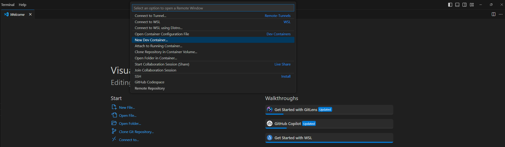
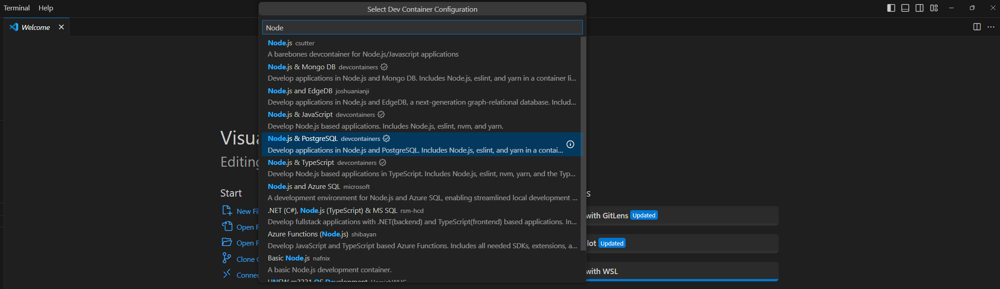
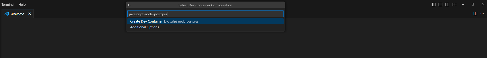

**👨‍💻 Tecnologias / Technologies**

Esse projeto foi desenvolvido com as seguintes tecnologias / This project was developed with the following technologies:

- [Node.js](https://nodejs.org/en)
- [Typescript](https://www.typescriptlang.org/)
- [ExpressJS](https://expressjs.com/)
- [Prisma](https://www.prisma.io/)

-----------------------------------------------------------------------------------------------------------------------------------------------------------------------------------

**🚀 Como executar / How to run**

- Clone o repositório / Clone the repository 

- Instale as dependências com `npm i` / Install the dependencies with `npm i`

- Instale o [Visual Studio Code](https://code.visualstudio.com/) / Install Visual Studio Code

- Abra o projeto no Visual Studio Code / Open the project with Visual Studio Code

- Crie um [Dev Container](https://code.visualstudio.com/docs/devcontainers/tutorial) Node.js & PostgreSQL 

- Instale as dependências com `npm i` / Install the dependencies with `npm i`
- Inicie o servidor com `npx expo start --clear` / Start the server with `npx expo start --clear`

-----------------------------------------------------------------------------------------------------------------------------------------------------------------------------------

**🧑🏾‍💻 Autor / Author**

**Matheus Gomes de Souza**

LinkedIn: https://www.linkedin.com/in/matheus-gomes-de-souza/  
E-mail: matheusg_souza@outlook.com
